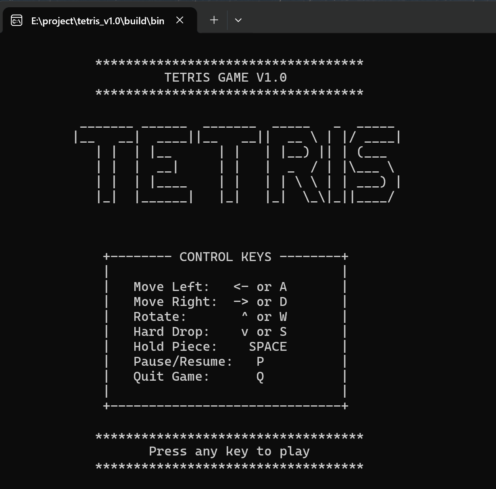

# 🎮 俄罗斯方块游戏 - C语言实现

## 👤 我是谁？
**Alexander Hou** ([GitHub: Cling](https://github.com/Cling))

> 大一网络空间安全专业学生 | C语言爱好者 | 来自杭州电子科技大学

## 📖 项目简介
一个完全用C语言写的俄罗斯方块，在控制台黑框框里运行。  
实现了方块下落、旋转、消除、计分这些基础功能，还加了颜色和简单的动画效果。  
代码都是上课学的知识点：指针、结构体、数组、函数——只不过我把它们组合成了一个游戏。

## 🎯 我做到了什么？

### 🧩 基础功能齐全
- **7种经典方块**：I、J、L、O、S、T、Z 都能正常旋转
- **完整的游戏逻辑**：下落、移动、碰撞检测、行消除
- **计分系统**：消除行数越多，分数越高
- **难度递增**：等级越高，方块下落越快

### 🎨 一些“哇塞”效果
- **彩色界面**：不同方块颜色不一样（用了Windows API的小技巧）
- **Hold功能**：可以暂存一个方块，需要时再拿出来
- **Next预览**：显示下一个方块是什么
- **暂停界面**：按P键可以暂停

### ⌨️ 操作简单

这是键盘操作映射表嗷~~

|    功能说明    |   主要按键   | 备用按键 |        响应特性        |
| :------------: | :----------: | :------: | :--------------------: |
|  **向左移动**  | 左箭头键 (←) |   A 键   |  即时移动，遇障碍停止  |
|  **向右移动**  | 右箭头键 (→) |   D 键   |  即时移动，遇障碍停止  |
| **顺时针旋转** | 上箭头键 (↑) |   W 键   |      支持墙踢机制      |
|   **硬降落**   | 下箭头键 (↓) |   S 键   |      瞬间落到底部      |
|  **暂存方块**  |    空格键    |    -     |   每下落周期限用一次   |
| **暂停/继续**  |     P 键     |    -     | 切换状态，显示暂停界面 |
|  **退出游戏**  |     Q 键     |    -     | 安全退出，显示最终得分 |

## 🚀 怎么运行？（一分钟搞定）

### 最简单的方法（推荐）
1. 下载 `tetris.exe`（在 `build/bin/` 文件夹里）
2. 双击运行
3. 开始游戏！

### 想自己编译？（也不难）
需要安装：VS Code + C/C++扩展 + CMake

步骤：
1. 用VS Code打开项目文件夹
2. 按 `F7` 编译
3. 按 `F5` 运行

（详细步骤可以自己探索，但建议先直接玩起来！）

## 🎮 游戏演示



## 💻 代码长什么样？

### 文件结构（很简单）
```
tetris_game/
├── .git/                    # Git版本控制目录
├── build/                   # 构建输出目录（编译生成文件）
    └── bin					 
        └──tetris.exe        # 可执行程序
├── include/                 # 头文件目录
│   └── tetris.h             # 游戏核心头文件
├── src/                     # 源代码目录
│   ├── main.c               # 程序入口与主循环
│   ├── board.c              # 界面渲染模块
│   ├── block.c              # 方块操作模块
│   └── logic.c              # 游戏逻辑模块
├── CMakeLists.txt           # CMake构建配置文件
└── README.md                # 项目说明文档
```


## 🤔 这个项目会继续更新吗？

### 近期计划（寒假前）
- [ ] 加个重新开始功能
- [ ] 保存最高分到文件
- [ ] 做个更酷的开始界面
- [ ] 优化代码结构（我的函数太长了）

### 如果下学期数据结构学得好...
想试试：
- 用链表管理下落中的方块？
- 写个简单的AI自己玩？
- 支持自定义方块形状？

（先画个饼，能不能实现看考试分数😂）

## 🙋 想一起玩吗？

如果你是：
- 同样在学C语言的同学
- 想找个项目练手的新手
- 不嫌弃我代码水平的大佬

**欢迎你：**
- 下载代码随便改
- 告诉我哪里可以优化
- 分享你的项目经验
- 一起讨论怎么让游戏更好玩

## 📜 许可证说明

### 🆓 你可以用它做什么？

**MIT 许可证**意味着你可以：

#### ✅ 允许的事情
1. **随便下载**：不用告诉我，直接下载代码去玩
2. **随意修改**：改成你喜欢的颜色、调整游戏规则、加新功能
3. **分享给同学**：上课无聊时可以玩玩，别被老师发现就行
4. **作为作业参考**：可以参考我的思路，但**代码要自己写**哦（老师能看出来抄袭的！）
5. **商用也可以**：虽然很难想象这个控制台游戏怎么赚钱😂

#### ❌ 唯一的要求
在你的版本里**保留我的名字和许可证声明**，就像这样：
```c
/* 
 * 基于 Alexander Hou 的俄罗斯方块项目修改
 * 原项目：https://github.com/Cling/tetris-game
 */
```

### 📝 完整许可证内容

项目根目录下的 `LICENSE` 文件里有完整的法律条文，但说实话——  
**我自己都没完全看懂那些法律术语** 😅

核心意思就是：
> “代码给你了，随便用，出问题了别找我，记得提一下我的名字就行。”

## 🌱 开源初体验

这是我**第一个开源项目**，很多地方不专业：
- 代码注释不够规范
- 没有写测试用例
- 版本管理比较随意

但这就是真实的学生项目——  
**不完美，但在努力进步。**

作为一个学生项目，我希望它：

1. **帮助更多人**：让学C语言的同学看到可能性
2. **持续改进**：大家一起来找bug、提建议
3. **记录成长**：从大一粗糙的代码，到逐渐规范的项目

希望这个项目能让你感受到：
> **开源不是大神专利，每个学习者都可以参与和贡献。**

---
**许可证版本：** MIT License  
**生效时间：** 项目创建时自动添加  
**更新记录：** 如果有法律大佬指出问题，我会及时修正  

---

## 💭 最后想说

做这个项目之前，我觉得“游戏开发”离我很远。  
做完之后我发现：**编程最酷的不是语法多熟练，而是能用代码创造出有趣的东西。**

我的代码还有很多问题，算法也不够优化，但——  
**这是我第一个从零到一完成的项目，我很自豪。**

**代码是冰冷的，但分享是温暖的。**  
希望这个小小的俄罗斯方块项目，能成为你编程路上的一个有趣注脚。

希望这个项目能给你一些启发：  
**不用等到“准备好”，现在就可以开始创造。**

*“好的代码应该像童话故事——不是因为它简单，而是因为它对每个读者都有意义。”*

---

## 📞 找到我

**GitHub:** [Cling](https://github.com/Cling)  
**邮箱:** 25270230@hdu.edu.cn  
**留言:** GitHub Issues里随便说，我每天都看哦

🎮 **快乐游戏，快乐编码！**  
👨‍💻 **Alexander Hou | 杭电大一学生 | 编程萌新**  
📅 **2025年12月 · 记录我的第一个项目**